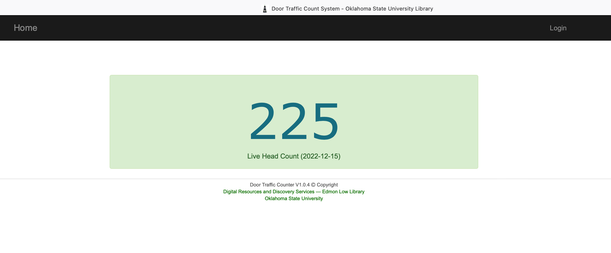
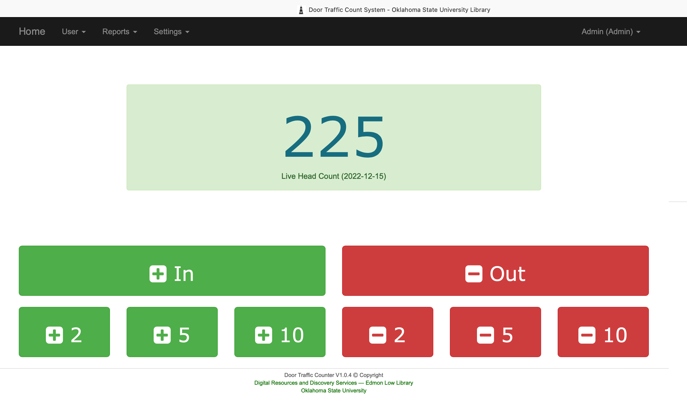
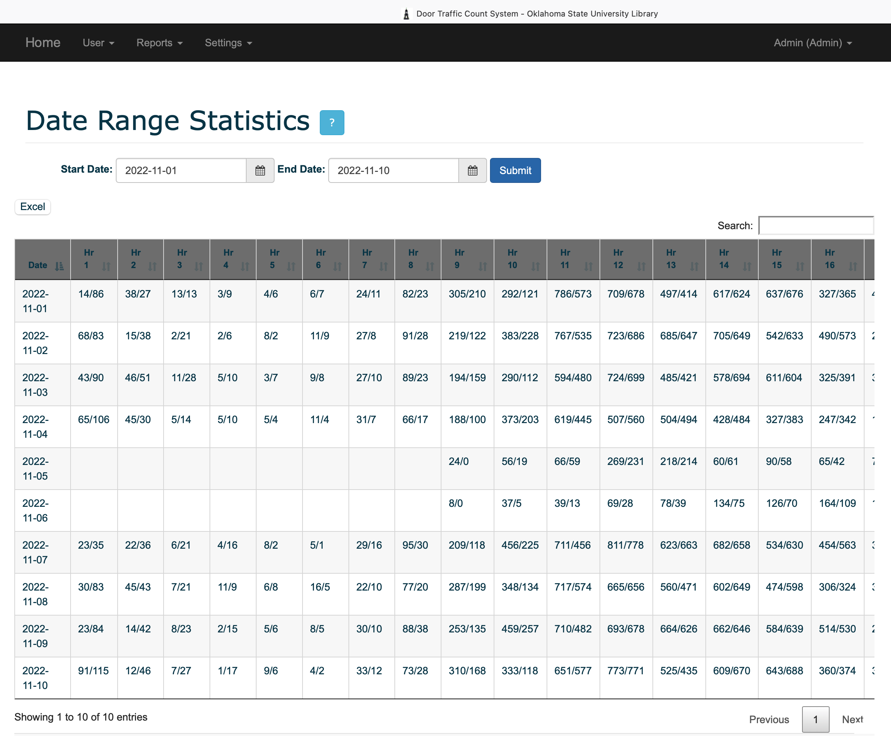
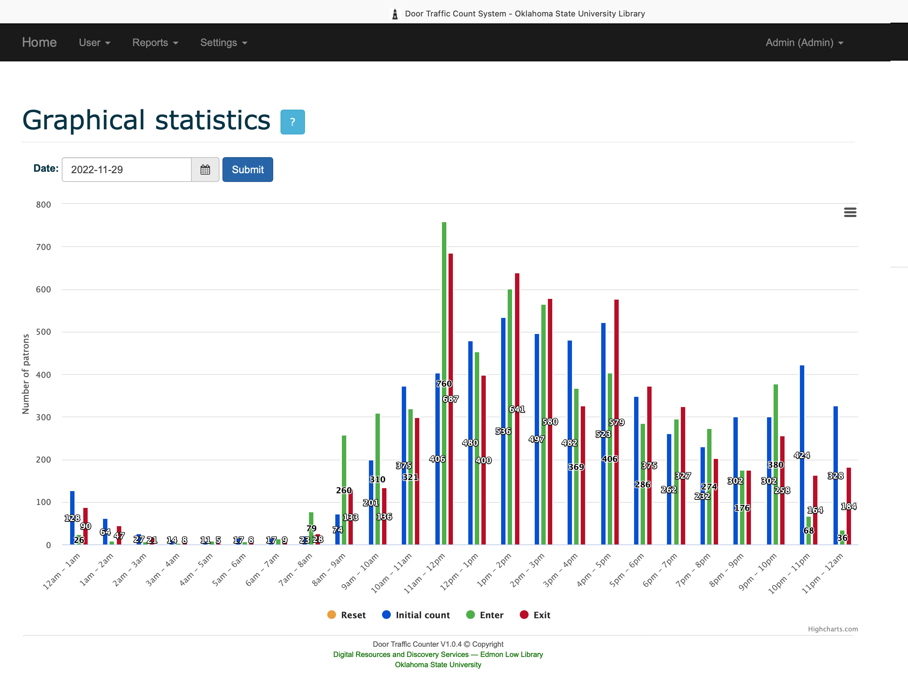

# door-traffic-counter

Spring Boot/Spring Data/Spring Security/Hibernate/MySQL/REST

The project simulates manual people counting online system. It allows to register/login users, modification of counting, reset the count, statistics.

There are two roles user and admin.

## Thing to run the application

__Clone the repository__
```
git clone https://github.com/okstate-library/door-traffic-counter.git
```

__Go the folder__
```
src/main/resources/sql and run the "make_database.sql" sql in Mysql DBMS.
```

There are two roles user and admin. 

The admin username and password are "admin". After setup user can change his password.

__Set Your MySQL username & password in application.properties__

Change the server, usernmae and password on [application.properties](../../blob/master/src/main/resources/application.properties)

__Run the application__
```
mvn clean spring-boot:run
```

## Screen shot 

### Index Page



### Dashboard Page (Data capturing Page)



### Statistics  Page




### Dashboard Page   



###### Build application
```
mvn clean build
```

###### Run application
```
java -jar target/door-traffic-counter-app-0.0.1
```

Check the URL "http://localhost:8080".
