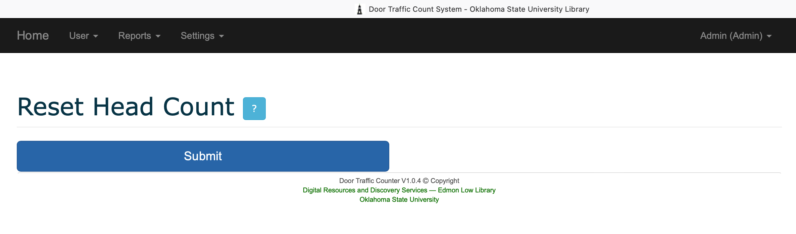
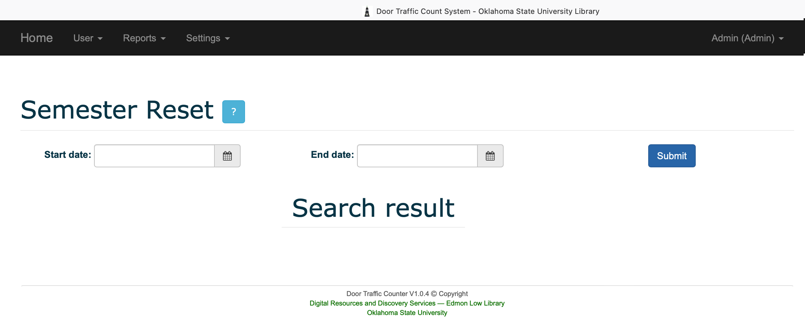

# door-traffic-counter

Spring Boot/Spring Data/Spring Security/Hibernate/MySQL/REST

The project simulates manual people counting online system. It allows to register/login users, modification of counting, reset the count, and statistics.

There are two types of roles user and administrator.

## Things to run the application.

__Clone the repository__
```
git clone https://github.com/okstate-library/door-traffic-counter.git
```

__Go the folder__
```
src/main/resources/sql and run the "make_database.sql" SQL in MySql DBMS.
```

The administrator user name and password are "admin". After setup the system user can change his/her password.

__Set Your MySQL user name & password in application.properties__

Change the server, user name and password on [application.properties](../../blob/master/src/main/resources/application.properties)

__Run the application__
```
mvn clean spring-boot:run
```

## Screen shots.

### Index Page


### Dashboard Page (Data capturing Page)


### Statistics  Page


### Statistics Graph Page   


### Reset Page   



### Semester count reset page



## Build application and run on a live environment.

###### Build application
```
mvn clean build
```

###### Run application
```
java -jar target/door-traffic-counter-app-0.0.1
```

Check the URL "http://localhost:8080".

###### External API

Check the API "http://localhost:8080/api/currenttraffic" returns (Json Object)-  {"count":311,"date":"2020-07-08"}
